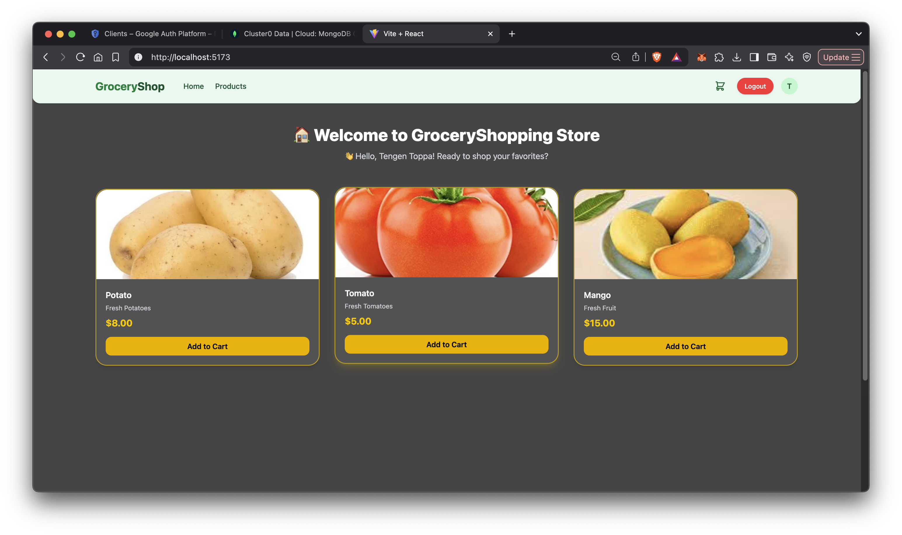
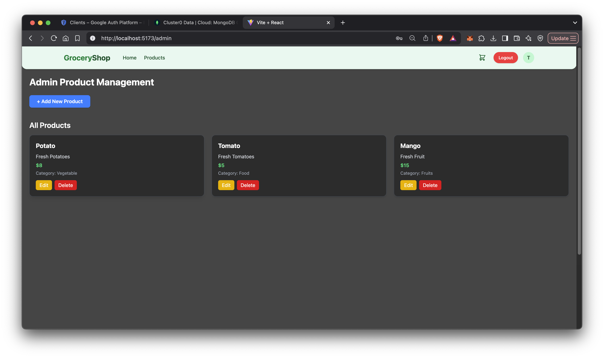
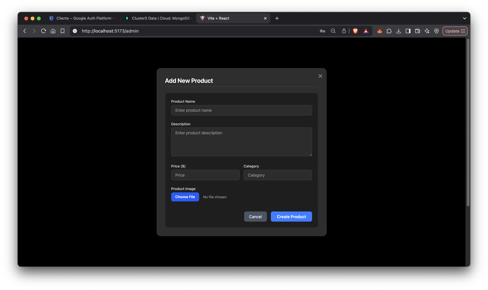
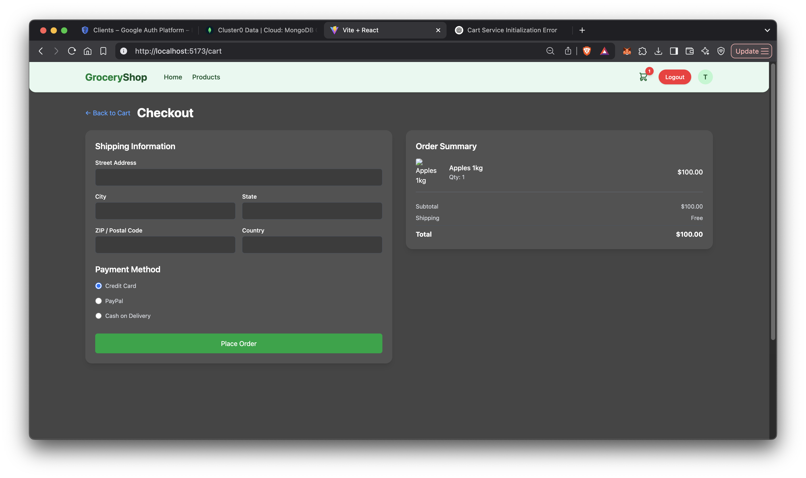

TO LOCALLY RUN THIS PROJECT

DOWNLOAD THE SOURCE CODE AND SET UP THE .env FILES FOR THE FRONTEND AND EACH SERVICE AND DOWNLOAD THE NODE MODULES using `npm install` on the terminal    

USE DIFFERENT TERMINALS TO RUN AND TEST EACH SERVICE     

TO CONNECT WITH FRONTEND RUN API GATEWAY BEFORE OTHER SERVICES    

to run each service in the separate terminal : `npm run start` or `npm run dev`   

Eg. Running the Auth Service       
`cd/backend/authService`    
`npm install`       
`npm run dev`    
    
TO REGISTER AN ADMIN USER - USE POSTMAN    
MAKE A `POST` REQUEST TO `http://localhost:5001/api/auth/register` <use auth service port no. here>.      
ADD RAW DATA (JSON):        
   
{      
  "username": "admin",   
  "email": "admin@example.com",   
  "password": "admin123",   
  "role": "admin"     
}    

FOR FRONTEND:    
DOWNLOAD NODE MODULES : `npm install`         
RUN `npm run dev`      

